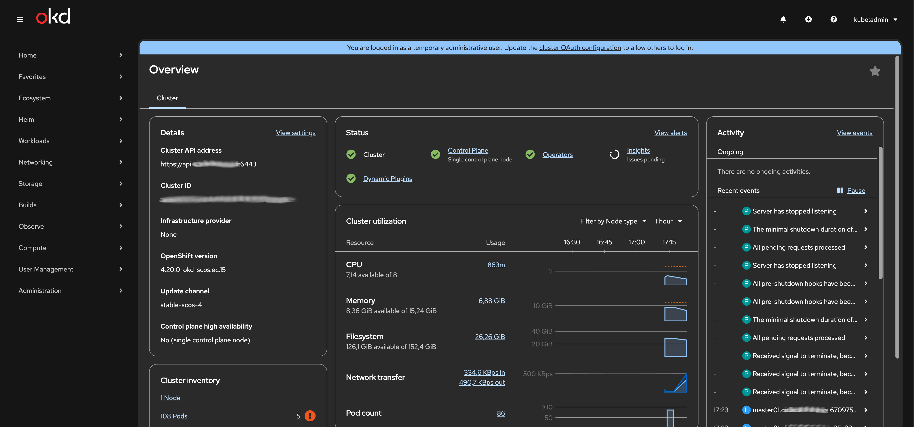

# hcloud-okd4

Deploy OKD4 (OpenShift) on Hetzner Cloud using HashiCorp Packer, Terraform, and Ansible.



---

## Important Notice

Hetzner Cloud does **not** meet the I/O performance and latency requirements for etcd – even when using local SSDs (not Ceph). This may cause issues during the cluster bootstrap phase.

This setup is suitable for small test environments only. Not recommended for production clusters.**

---

## Architecture

By default, a single-node cluster is deployed with the following components:

| Component     | Type / Size |
|---------------|-------------|
| Master Node   | cpx41       |
| Load Balancer | lb11        |
| Bootstrap Node| cpx41 (removed after bootstrap) |
| Ignition Node | cpx21 (removed after bootstrap) |

Additional worker nodes can be added by setting an environment variable **before** running Terraform:

```bash
export TF_VAR_replicas_worker=3  # Example: 3 worker nodes
```

---

## Version & Deployment Options

You can set the desired release version with the `OPENSHIFT_RELEASE` environment variable.

Example:

```bash
export DEPLOYMENT_TYPE=okd   # Options: "okd" or "ocp", default is "okd"
export OPENSHIFT_RELEASE=$(make latest_version)
```

For OCP (Red Hat OpenShift), you will also need a valid pull secret, available from cloud.redhat.com.

---

## Quick Start

1. Build and start the toolbox
   ```bash
   make fetch
   make build
   make run
   ```
2. Create `install-config.yaml` (see example in *Configuration*)
3. Export required environment variables (Terraform, credentials, etc.)

3. Generate manifests
   ```bash
   make generate_manifests
   ```
4. Generate ignition configs
   ```bash
   make generate_ignition
   ```
5. Build Fedora CoreOS image using Packer
   ```bash
   make hcloud_image
   ```
6. Deploy infrastructure with Terraform (including bootstrap)
   ```bash
   make infrastructure BOOTSTRAP=true
   ```
7. Wait for bootstrap completion
   ```bash
   make wait_bootstrap
   ```
8. Remove bootstrap and ignition nodes
   ```bash
   make infrastructure
   ```
9. Wait for installation to finish
    ```bash
    make wait_completion
    ```
10. Approve worker CSRs (if workers are deployed)
    ```bash
    make sign_csr
    sleep 60
    make sign_csr
    ```

---

## Configuration

### Example: install-config.yaml

```yaml
apiVersion: v1
baseDomain: 'example.com'
metadata:
  name: 'okd4'
compute:
  - hyperthreading: Enabled
    name: worker
    replicas: 0
controlPlane:
  hyperthreading: Enabled
  name: master
  replicas: 1
networking:
  clusterNetworks:
    - cidr: 10.128.0.0/14
      hostPrefix: 23
  networkType: OVNKubernetes
  serviceNetwork:
    - 172.30.0.0/16
machineCIDR: platform:
  none: {}
pullSecret: '{"auths":{"none":{"auth":"none"}}}'
sshKey: ssh-rsa AAAA…<your ssh key here>
```

### Required Environment Variables

```bash
# Terraform / DNS
export TF_VAR_dns_domain=okd4.example.com
export TF_VAR_dns_zone_id=YOUR_ZONE_ID

# Hetzner Cloud access
export HCLOUD_TOKEN=YOUR_HCLOUD_TOKEN

# Cloudflare access (if required)
export CLOUDFLARE_EMAIL=user@example.com
export CLOUDFLARE_API_KEY=YOUR_API_KEY
```

---

## Firewall & Access

- Nodes are **not directly exposed to the internet** by default.
- Only the load balancer is publicly accessible.
- SSH access to nodes is possible if port 22 is explicitly opened.

---

## Deploying OCP (Red Hat OpenShift)

To deploy OCP instead of OKD:

```bash
export DEPLOYMENT_TYPE=ocp
export OPENSHIFT_RELEASE=4.19.10  # example version
make fetch
make build
make run
```

You can also choose the latest version from a specific channel:

```bash
export OCP_RELEASE_CHANNEL=stable-4.19
export OPENSHIFT_RELEASE=$(make latest_version)
make fetch build run
```

---

## Limitations / Not for Production

- I/O performance and latency issues with etcd (see above).
- Components that rely on strong consistency (like etcd) may suffer under heavy load.
- No stability guarantees for large clusters or production use.

---

## Author

[slauger](https://github.com/slauger)
