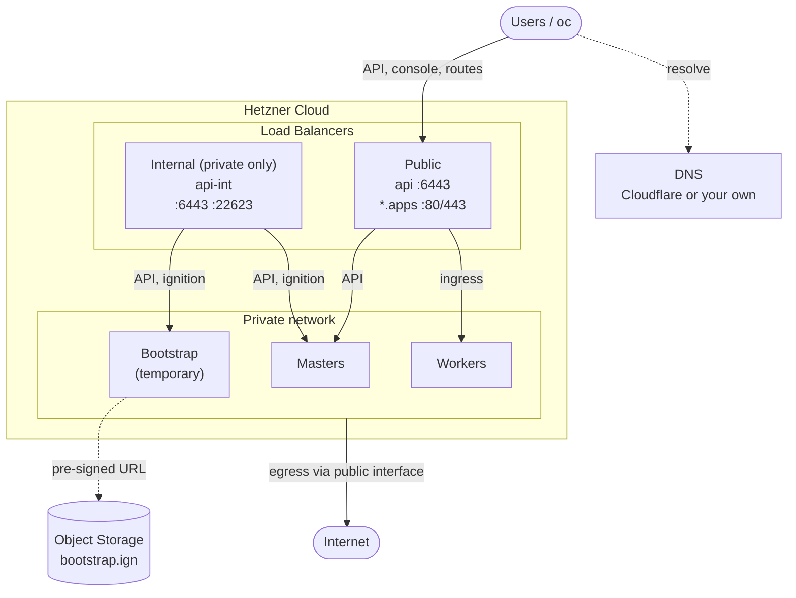

[](https://github.com/slauger/hcloud-okd4/actions/workflows/ci.yaml)
[](LICENSE)

# hcloud-okd4

Deploy OKD (and Red Hat OpenShift) clusters on Hetzner Cloud using Packer and Terraform – a cheap and fast way to get a real OpenShift cluster for testing, development and learning.

- OKD and OCP 4.x, single node or with additional workers
- User provisioned infrastructure (`platform: none`), no cloud integration required
- Cluster traffic over a Hetzner private network, nodes are not exposed to the internet
- Bootstrap ignition config served from Hetzner Object Storage, no helper VMs
- About 45 minutes from zero to a running cluster

---

## Deploy with a Coding Agent

Need an OKD or OpenShift test cluster without reading all of this? Copy the prompt from [docs/coding-agent.md](docs/coding-agent.md) into your AI coding agent of choice.

---

## Architecture


```mermaid
flowchart TB
  user(["Users / oc"])
  dns["DNS<br/>Cloudflare or your own"]

  subgraph hcloud["Hetzner Cloud"]
    subgraph lbs["Load Balancers"]
      direction LR
      lb["Public<br/>api :6443<br/>*.apps :80/443"]
      lbint["Internal (private only)<br/>api-int<br/>:6443 :22623"]
    end
    subgraph net["Private network"]
      direction LR
      bootstrap["Bootstrap<br/>(temporary)"]
      master["Masters"]
      workers["Workers"]
    end
  end

  internet(["Internet"])
  s3[("Object Storage<br/>bootstrap.ign")]

  user -.->|"resolve"| dns
  user -->|"API, console, routes"| lb
  lb -->|"API"| master
  lb -->|"ingress"| workers
  lbint -->|"API, ignition"| bootstrap & master
  net -->|"egress via public interface"| internet
  bootstrap -.->|"pre-signed URL"| s3
```

By default, a single-node cluster is deployed with the following components:

| Component     | Type / Size |
|---------------|-------------|
| Master Node   | cpx42       |
| Load Balancer | 2× lb11 (public and internal) |
| Bootstrap Node| cpx42 (removed after bootstrap) |

The bootstrap ignition config is too large for Hetzner Cloud user data. It is therefore uploaded to a private Hetzner Object Storage bucket and the bootstrap node fetches it through a short-lived pre-signed HTTPS URL.

### Networking

All nodes are attached to a Hetzner private network. Cluster traffic (etcd, API, OVN-Kubernetes overlay, kubelet) uses the private interface, while the public interface is only used as default route for outbound traffic. The load balancer reaches its targets via their private IPs, and `api-int` as well as the node DNS records resolve to private addresses. The overlay MTU is lowered to 1350 to fit the private network (MTU 1450), see `manifests/cluster-network-03-config.yml`.

Hetzner Cloud offers neither SLAAC nor DHCPv6, so each node gets a pre-allocated IPv6 primary IP, which is configured statically (`<prefix>::1/64`, gateway `fe80::1`) together with Cloudflare resolvers. The cluster network itself stays IPv4 only.

### Hetzner Cloud Specifics

Hetzner Cloud is not a supported OpenShift platform and several of its properties (DNS caching, `/32` private addresses, no IPv6 autoconfiguration, user data limits, ...) need special handling. They are explained in [docs/hetzner-specifics.md](docs/hetzner-specifics.md), read it before changing the network setup or when debugging an installation.

### Costs

Approximate prices, **as of 2026-10-05** (net, location `nbg1`, taken from the Hetzner Cloud pricing API). Prices change over time, check the current [Hetzner Cloud pricing](https://www.hetzner.com/cloud/) before deploying. Hetzner bills hourly, capped at the monthly price.

| Setup | Per hour | Per month |
|---|---|---|
| Single node (1× master cpx42, 2× lb11, IPv4) | ~0.13 € | ~84 € |
| Default with 2 workers (3× cpx42, 2× lb11, 3× IPv4) | ~0.36 € | ~224 € |
| ARM64 single node (1× master cax31, 2× lb11, IPv4, OCP only) | ~0.06 € | ~35 € |
| ARM64 with 2 workers (3× cax31, 2× lb11, 3× IPv4, OCP only) | ~0.13 € | ~78 € |
| Bootstrap node during installation (same server type as the nodes, ~15–25 min, billed per started hour) | ~0.11 € (cpx42) / ~0.03 € (cax31) once | – |
| Additional volumes (`TF_VAR_*_volume_size`) | – | ~0.06 € per GB |
| CoreOS snapshot (~1 GB) | – | ~0.01 € |

Hetzner Object Storage is billed separately with a monthly base fee once a bucket exists, see the Hetzner pricing page. These are infrastructure costs only, OCP additionally requires a Red Hat subscription (or runs as a 60 day evaluation).

### Duration

Measured with OKD 4.22 and OCP 4.22, 1 master and 2 workers:

| Step | Duration |
|---|---|
| OpenShift binaries (`make fetch`) | ~1 min |
| CoreOS image (`make hcloud_image`) | ~10 min |
| Infrastructure (`make infrastructure BOOTSTRAP=true`) | ~3 min |
| Bootstrap (`make wait_bootstrap`) | ~12 min |
| Installation (`make wait_completion`) | ~15–25 min |
| **Total** | **~45–55 min**, ~30–40 min with an existing image |

Additional worker nodes and a highly available control plane can be configured by setting environment variables **before** running Terraform:

```bash
export TF_VAR_replicas_worker=3  # Example: 3 worker nodes
export TF_VAR_replicas_master=3  # 1 (default) or 3 masters
```

The number of masters has to match `controlPlane.replicas` in `install-config.yaml`. With 3 masters the control plane survives the restarts during the installation and updates without API outages.

Server and load balancer types as well as the location can be changed the same way:

```bash
export TF_VAR_server_type=cpx52          # all nodes, default: cpx42 (x86) or cax31 (arm)
export TF_VAR_worker_server_type=ccx33   # per role, also bootstrap_server_type and master_server_type
export TF_VAR_load_balancer_type=lb21    # default: lb11, used for both load balancers
export TF_VAR_location=ash               # default: nbg1
export TF_VAR_network_zone=us-east       # default: eu-central, has to contain the location
```

The CoreOS snapshot keeps the disk size of the Packer builder (cpx32 / cax31), so every server type needs at least that much disk, see [docs/hetzner-specifics.md](docs/hetzner-specifics.md).

### Additional Disks (LVM Storage / Ceph)

Master and worker nodes can get an additional, unformatted Hetzner Volume for storage operators:

```bash
export TF_VAR_worker_volume_size=100 # GB per worker, 0 (default) = no volume
make infrastructure
```

Details and examples for the LVM Storage operator and Rook-Ceph are in [docs/storage.md](docs/storage.md).

---

## Version & Deployment Options

You can set the desired release version with the `OPENSHIFT_RELEASE` environment variable.

Example:

```bash
export DEPLOYMENT_TYPE=okd # Options: "okd" or "ocp", default is "okd"
export OPENSHIFT_RELEASE=$(make latest_version) # or a fixed version like "4.22.0-okd-scos.9"
```

`make latest_version` returns the most recent stable (non pre-release) OKD release and fails if none is found. It queries the GitHub API, set `GITHUB_TOKEN` to avoid its rate limit for anonymous requests. To stay on a specific minor stream, set `OKD_RELEASE_STREAM`:

```bash
export OPENSHIFT_RELEASE=$(make latest_version OKD_RELEASE_STREAM=4.22)
```

For OCP (Red Hat OpenShift), you will also need a valid pull secret, available from [console.redhat.com](https://console.redhat.com/openshift/install/pull-secret).

### Toolbox

All steps run inside a toolbox container with Terraform, Packer, the AWS CLI and the other required tools. The image is version independent and available for amd64 and arm64, it always runs natively in the architecture of your machine (`TOOLBOX_ARCH`, detected automatically). The OpenShift binaries (`openshift-install`, `oc`, `kubectl`) are downloaded per release into `downloads/<okd|ocp>/<version>/<toolbox arch>/` of the repository, which is mounted into the toolbox. Several versions can live side by side.

```bash
docker pull ghcr.io/slauger/hcloud-okd4:latest # or build it locally: make build
make fetch                                     # downloads and verifies the binaries of OPENSHIFT_RELEASE
make run                                       # starts the toolbox, oc and openshift-install are in the PATH
```

When running make targets in the toolbox yourself, pass `--platform linux/<toolbox arch>` to `docker run` if `DOCKER_DEFAULT_PLATFORM` points to another architecture.

### ARM64 Clusters (OCP)

OCP clusters can run on Hetzner's Ampere based CAX servers, which cost about a third of the corresponding CPX servers. OKD does not publish arm64 release payloads, so this is only available for OCP.

```bash
export DEPLOYMENT_TYPE=ocp
export ARCH=arm64 # builds the RHCOS aarch64 image on cax31 and uses cax31 nodes
```

Set `architecture: arm64` for `controlPlane` and `compute` in `install-config.yaml`. The aarch64 release payload is selected automatically.

---

## Quick Start

1. Fetch the OpenShift binaries and start the toolbox (see *Toolbox*)
   ```bash
   make fetch
   make run
   ```
2. Create `install-config.yaml` (see example in *Configuration*)
3. Generate manifests
   ```bash
   make generate_manifests
   ```
4. Generate ignition configs
   ```bash
   make generate_ignition
   ```
5. Export required environment variables (see example in *Configuration*)
6. Build CentOS Stream CoreOS (OKD) or Red Hat CoreOS (OCP) image using Packer
   ```bash
   make hcloud_image
   ```
   The snapshot is labeled with its CoreOS release. If a snapshot of the same release already exists, it is reused (`REBUILD=true` builds a new one), and Terraform picks the snapshot that matches `OPENSHIFT_RELEASE`. Without a matching one it falls back to the most recent snapshot and prints a warning.
7. Deploy infrastructure with Terraform (uploads the bootstrap ignition config to Object Storage and creates the bootstrap node)
   ```bash
   make infrastructure BOOTSTRAP=true
   ```
8. Wait for bootstrap completion
   ```bash
   make wait_bootstrap
   ```
9. Remove bootstrap node (also deletes the bootstrap ignition config from Object Storage)
   ```bash
   make infrastructure
   ```
10. Wait for installation to finish
    ```bash
    make wait_completion
    ```
11. Approve worker CSRs (if workers are deployed)
    ```bash
    make sign_csr
    sleep 60
    make sign_csr
    ```
---

## Configuration

### Example: install-config.yaml

```yaml
apiVersion: v1
baseDomain: 'example.com'
metadata:
  name: 'okd4'
compute:
  - hyperthreading: Enabled
    name: worker
    replicas: 0
controlPlane:
  hyperthreading: Enabled
  name: master
  replicas: 1
networking:
  clusterNetwork:
    - cidr: 10.128.0.0/14
      hostPrefix: 23
  networkType: OVNKubernetes
  serviceNetwork:
    - 172.30.0.0/16
  machineNetwork:
    - cidr: 192.168.254.0/24 # has to match TF_VAR_subnet_cidr (default)
platform:
  none: {}
pullSecret: '{"auths":{"none":{"auth":"none"}}}'
sshKey: ssh-rsa AAAA…<your ssh key here>
```

`metadata.name` and `baseDomain` together form the cluster domain (`okd4.example.com` in this example), which has to match `TF_VAR_dns_domain`. `machineNetwork` has to be the private subnet of the nodes, otherwise the bootstrap etcd advertises its public address, which is not reachable through the firewall.

### Required Environment Variables

```bash
# Terraform / DNS
export TF_VAR_dns_domain=okd4.example.com
export TF_VAR_dns_provider=cloudflare # or "none", see DNS
export TF_VAR_dns_zone_id=YOUR_ZONE_ID # only for cloudflare

# Hetzner Cloud credentials
export HCLOUD_TOKEN=YOUR_HCLOUD_TOKEN

# Cloudflare credentials (only for dns_provider=cloudflare)
export CLOUDFLARE_EMAIL=user@example.com
export CLOUDFLARE_API_KEY=YOUR_API_KEY

# Hetzner Object Storage (bootstrap ignition config)
export S3_BUCKET=YOUR_BUCKET
export S3_LOCATION=nbg1 # optional, default: nbg1
export AWS_ACCESS_KEY_ID=YOUR_S3_ACCESS_KEY
export AWS_SECRET_ACCESS_KEY=YOUR_S3_SECRET_KEY
```

### DNS

By default, all DNS records are managed in Cloudflare. With `TF_VAR_dns_provider=none` Terraform does not create any records (bring your own DNS) and prints the required records as output `dns_records`:

| Record | Value | Needed |
|---|---|---|
| `api-int.<cluster domain>` | IP of the internal load balancer (`192.168.253.254` by default) | **before** `make infrastructure BOOTSTRAP=true` |
| `<node>.<cluster domain>` | private node IP (bootstrap `.5`, masters `.10+`, workers `.50+` of the node subnet) | **before** `make infrastructure BOOTSTRAP=true` |
| `api.<cluster domain>`, `apps.<cluster domain>`, `*.apps.<cluster domain>` | public load balancer IP | after the infrastructure has been created |

`api-int` and the node records have to exist before the nodes boot, otherwise resolvers cache the negative answer and the nodes cannot fetch their configuration. Their addresses are fixed, so they can be created upfront.

The nodes use Cloudflare resolvers (`1.1.1.1`, `1.0.0.1`), also during the first boot. To use other resolvers, e.g. internal ones for your own DNS, set them for the image build and for Terraform:

```bash
make hcloud_image NAMESERVERS="10.0.0.53 10.0.0.54"
export TF_VAR_nameservers_ipv4='["10.0.0.53","10.0.0.54"]'
export TF_VAR_nameservers_ipv6='[]'
```

### Object Storage

Hetzner does not offer an API to manage Object Storage credentials, so the bucket and the S3 credentials have to be created once in the Hetzner Console (*Object Storage* and *Security → S3 Credentials*). Keep the bucket private, access is granted through a pre-signed URL that expires after 24 hours (`S3_PRESIGN_EXPIRY`, matching the lifetime of the ignition certificates).

Anyone who knows the pre-signed URL can download the bootstrap config including its credentials until it expires. Besides `terraform/bootstrap.auto.tfvars`, the URL ends up in the Terraform state, in the user data of the bootstrap node and in `ignition/bootstrap01.<cluster domain>.ign`, so treat these as secrets. Removing the bootstrap node (`make infrastructure`) and `make destroy` also delete the config from the bucket, which invalidates the URL.

The config can also be uploaded or removed manually:

```bash
make upload_ignition
make delete_ignition
```

---

## Firewall & Access

- Nodes are **not directly exposed to the internet**: the hcloud firewall only allows ICMP on their public interfaces. Hetzner firewalls do not apply to private networks, so cluster traffic is not affected.
- Only the public load balancer is reachable from the internet (API on 6443, ingress on 80/443). The machine config server (22623) is only served by the internal load balancer, which has no public interface.
- SSH access to nodes is only possible with additional firewall configuration.

---

## Deploying OCP (Red Hat OpenShift)

To deploy OCP instead of OKD:

```bash
export DEPLOYMENT_TYPE=ocp
export OPENSHIFT_RELEASE=4.22.15 # example version
make fetch run
```

You can also choose the latest version from a specific channel:

```bash
export OCP_RELEASE_CHANNEL=stable-4.22
export OPENSHIFT_RELEASE=$(make latest_version)
make fetch run
```

---

## Limitations / Not for Production

- No stability guarantees for large clusters or production use.

---

## Author

[slauger](https://github.com/slauger)
